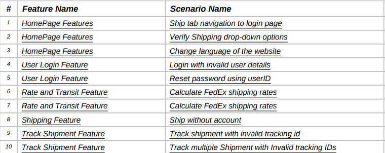
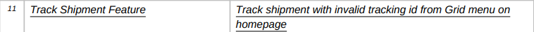
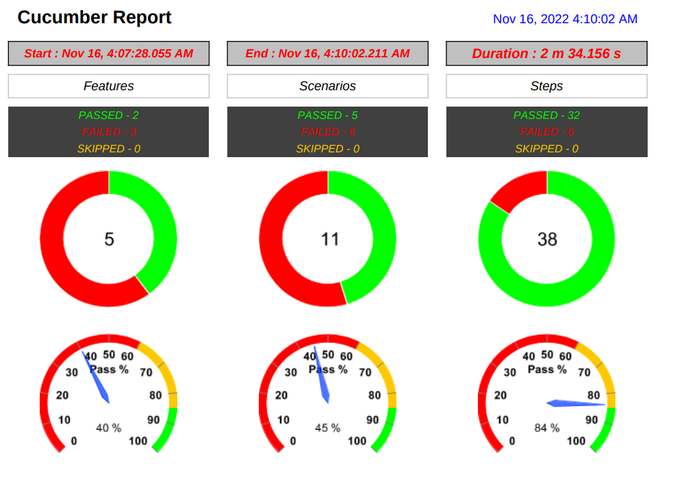
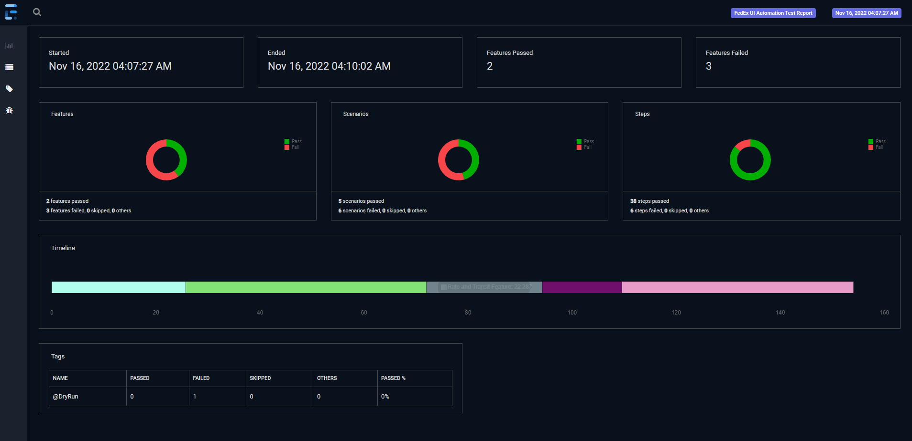

# Introduction

Hi everyone, my name is Nitin Agrahari. I am having 8+ years of experience in software testing.
I have worked as both Manual and Automation Tester.
I have experience with various test automation tools/frameworks like Cypress, Protractor, Cypress, UFT, Selenium Webdriver, Rest-Assured, etc. Also, having hands-on experience in API testing.

 
**FedEx experience:** I have worked in multiple projects in FedEx, mainly on TNT and FedEx Integration side. I was Test Lead in LineHaul Art and primarily testing ROCS application, both Legacy and modernisation.

# Framework Introduction
1. This is a Selenium WebDriver Framework with Cucumber BDD using Page Object Model design pattern. This framework is developed using Selenium WebDriver (Java), Cucumber-BDD, Maven, TestNG, WebDriverManager, Spark Extent Reports to test few regression test scenarios for www.fedex.com site which can be enhanced further as per project requirement.

2. **Test scenarios covered:**

3. **Key highlights of the framework :**
    1. Spark html and pdf reports for quick analysis on the test-results
    2. Screenshot when test failed
    3. Feature files allow us to work more closely with Business and entire team can be on same page on the requirements.
    4. WebDriver Manager library to automatically manage and setup all the drivers of all browsers which are in test scope
    5. Parallel execution

**Pre-requisite:**
1. Install java 8 and above
2. Install and configure maven in the system and into your IDE.

# Steps to run the tests

1. Download or clone this repo.
2. import project in an IDE (eg:- Intellij/eclipse)
3. import all the dependency from pom.xml in the project
4. run with test runner using testng 
            or
5. run with maven using 'mvn test' command
6. Validate the test report. Path: test-results/test-report (with date and time stamp)

# Defects found

1. When tracking shipment invalid tracking id, correct error message is not getting displayed most of the time.
2. When running automated test sometime website behave weirdly and asking to refresh the page during the execution. Message displayed - "We are having trouble establishing a connection. Please refresh the page"
3. Package Weight unit selection is disabled on the Shipment Details accordian of FedEx Ship Manager Lite app.
Step to reproduce:
   1. Go to homepage
   2. Navigate to Shipping->Ship with Account option
   3. Provide Address details
   4. Select package type in Shipment section/accordian
   5. Provide package weight
   6. Try changing the unit -> Unit field is disabled and kg is selected by default

# Further possible enhancements
1. Integrate with Jenkins for CI/CD
2. Run in headless browser
3. Execute test scenarios using tags
4. Add more test scenarios like Registration with valid data, login with valid data, ship with account and many more. 

# Assessment Note:
1. Sample report included in the commit, to showcase the reports. It can be excluded later on.

#Sample Reports:

<<Images will be deleted after the assignment review>>
